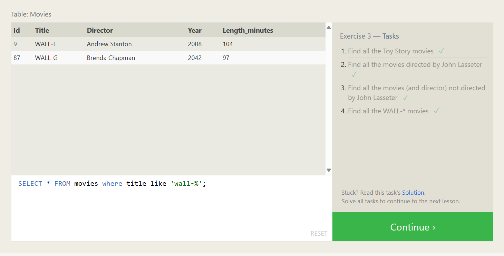

- SQL Lesson 1: SELECT queries 101 
  

- SQL Lesson 2: Queries with constraints (Pt. 1)
  

- SQL Lesson 3: Queries with constraints (Pt. 2)
  

- SQL Lesson 4: Filtering and sorting Query results
  

- SQL Review: Simple SELECT Queries
  

- SQL Lesson 6: Multi-table queries with JOINs
  

- SQL Lesson 7: OUTER JOINs
  

- SQL Lesson 8: A short note on NULLs  
  

- SQL Lesson 9: Queries with expressions
  

- SQL Lesson 10: Queries with aggregates (Pt. 1)
  

- SQL Lesson 11: Queries with aggregates (Pt. 2)
  

- SQL Lesson 12: Order of execution of a Query
  

- SQL Lesson 13: Inserting rows
  

- SQL Lesson 14: Updating rows
   
   
- SQL Lesson 15: Deleting rows
  zz
- SQL Lesson 16: Creating tables
    
- SQL Lesson 17: Altering tables
    
- SQL Lesson 18: Dropping tables
    